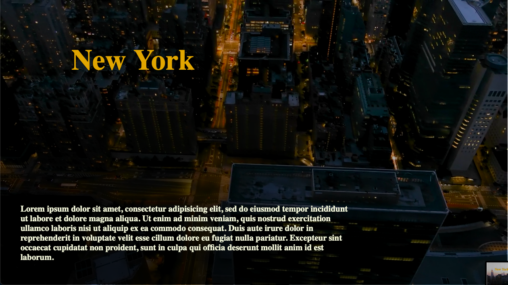
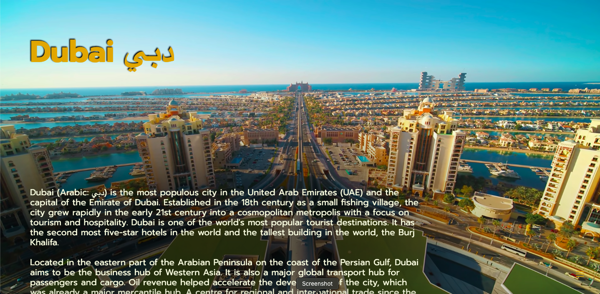

# Youtube Background

I made this little project from an idea that I had while I was asked to work on something related with compatibility of video formats for the most popular browsers. From my ongoing project that I was working on, at that time, I understood immediately that adding videos into a web page increases the weight of the overall project which is not ideal when deploying with an hosting service. For example, I was working with Google Cloud Firebase services to deploy my first project and I learned that in order to have a low cost or a free hosting site it's better to maintain as much as possible a lightweight website. In this website I wanted to have a dynamic background to attract the interest of the user and at the same time having it really light. In fact the video in background is directly coming from YouTube that is dynamically responsive as well depending on the device used like desktop, laptop, tablet and smartphone, resizing it depending on the width and height size of the screen and always positioning the center of the video in the center of the background view in order to have a better quality when viewed on vertical screens like smartphones. In the menu you can find different examples to enjoy and at the moment I'm working on one page that you can customize.   

<strong>IMPORTANT!</strong>
In order to enjoy the background on smartphones do Request Desktop Website because Youtube disabilitate the autoplay in order to prevent costly additional fees when a user is in roaming data usage.   

**Here you can find [YouTube Background](https://background-video.web.app).**

## Screenshots

  

  

